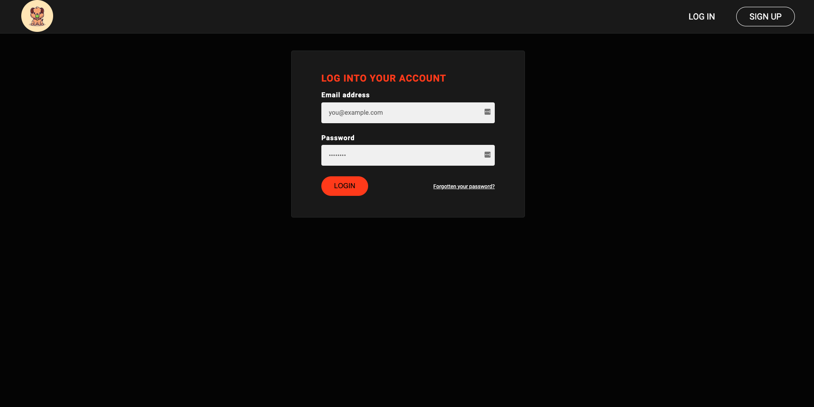
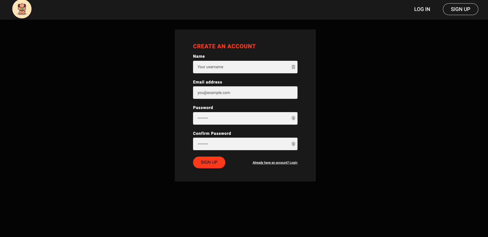
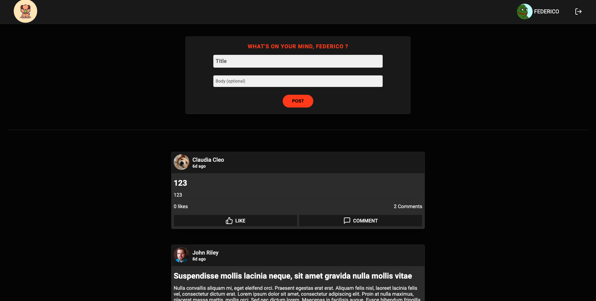
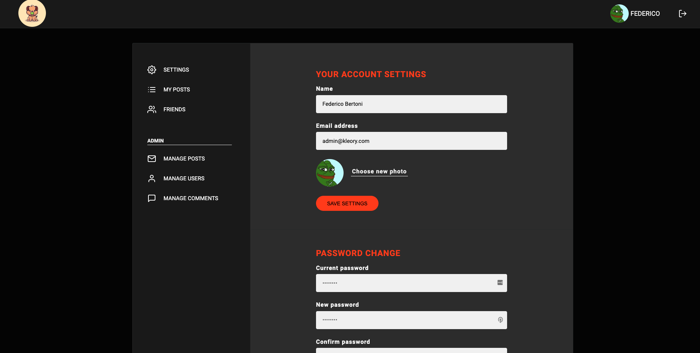

# Full Stack - Social Media Project

### The challenge

Users should be able to:

- Sign up and Log in.
- Reset password, Forget password and Update password.
- Post, Comment on a post, Delete a post, Delete a comment.
- Send friend request, Accept/Reject friend requests.
- See other user profile.
- Have a profile page.
- View the optimal layout for the interface depending on their device's screen size.
- Receive welcome email and reset password email
- And much more...

### Screenshot

### Built with

- SCSS
- Flexbox
- Node.js
- Express
- MongoDB
- Mongoose
- Pug
- Axios
- & More

### Live Website

- Live Preview - [Kleory](https://kleory.onrender.com)
- Log in credentials for testing purposes - USERNAME: leo@example.com PASSWORD: test1234
